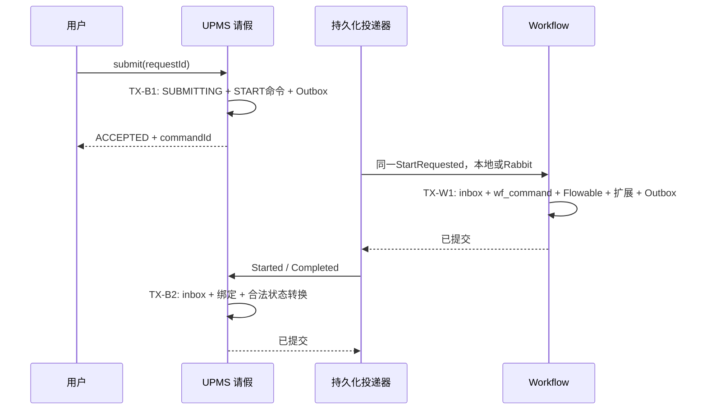

# 阶段二：双模幂等与可靠协作 Implementation Plan

> **For agentic workers:** 执行时使用 `superpowers:subagent-driven-development` 或 `superpowers:executing-plans`，按复选任务逐项实现、审查和验证。普通实现选择已授权，不增加提交、推送或外部部署步骤。

**Goal:** 同一套审批和请假业务在 single 本地投递、cloud Rabbit 投递下，经请求重试、消息重复和进程崩溃仍恢复一致结果。

**Architecture:** 每个业务所有者在自己的数据库事务内保存业务状态、命令结果及 Outbox；接收端在另一事务内提交 inbox 和业务更新。`common-mq` 只提供无领域依赖的 JDBC 存储、领取和传输原语，事件契约放 `workflow-api`，Flowable 及请假处理器分别位于 `workflow-biz` 和 UPMS 的 `demo/leave`。

**Tech Stack:** Java 17、Spring Boot 3.4.1、本地 Spring 事务、MyBatis-Plus/JdbcTemplate、Flowable 7.1.0、MySQL 8、现有 Spring AMQP/RabbitMQ、Vue 3/TypeScript。

日期：2026-09-21。状态：实施中；阶段一及阶段二 2A 已完成验收，2B/2C 正在推进。未完成的复选项不代表已通过验收。继续遵守 `.docs/workflow/REQUEST.md`、`DESIGN.md`、`PROGRESS.md`；不编辑 `.docs/.chiwen.state.json`。

---

## 1. 已核对的实现及取舍

本轮先使用 CodeGraph，再对未返回的具体源码段补读。已核实：

- `ProcessInstanceServiceImpl.start` 在 Spring 事务中先启动 Flowable，后插扩展表；同步结束已做补判，但没有 requestId 或命令唯一键。
- `WorkflowCompletionListener` 运行于引擎事务，错误会抛出；同步启动时扩展记录尚不存在，由 `start` 补终态。保留这一时序，统一在扩展记录可见后持久化事件。
- `WfTaskServiceImpl` 已校验权限和实际办理人、写审批记录；重复完成在任务查询处失败，没有稳定命令结果。
- `LeaveRequestService.submit` 先提交 `SUBMITTING`，再同步 `WorkflowService.startProcess`；模糊失败会留下未绑定申请。`receive` 在尚未绑定时直接返回，因此不能接上 inbox 后仍把这种返回当作“处理成功”。
- `WorkflowResultNotifier` 只在 AFTER_COMMIT 里尝试同步回调，失败只记录日志。它是阶段一过渡实现；阶段二必须替换，不能与可靠链路长期双投递。
- `common-mq` 目前只有 Rabbit JSON converter；无可复用 Outbox/inbox。UPMS 已依赖它；Workflow 需增加显式依赖。无新的业务仓库拆分需求。
- 当前 `BixiUser` 没有租户字段，也无完整租户拦截链。本阶段内部 `tenantScope` 固定由服务器设为 `default`，保留契约字段但不宣称多租户隔离。

比较过三种放置方式：把全部可靠消息放 `workflow-biz` 会迫使 UPMS 依赖实现；全部放 `workflow-api` 会让契约包含 JDBC 和调度；把无领域依赖的原语放现有 `common-mq`、领域处理器各自拥有，改动最少且无反向依赖。选择第三种，不新建通用事件平台、通用工作流框架或第二套调度器。

## 2. 契约与必须保持的数据库不变量

### 2.1 请求标识、摘要和稳定结果

1. 所有公开流程写请求使用调用方稳定 UUID `requestId`，长度 36、标准小写 UUID 格式。浏览器一次用户意图生成一次；网络超时和“查询结果”复用，用户修改内容后明确生成新 ID。不得每次 HTTP 重发自动生成新值。
2. 幂等作用域是 `(tenant_scope, actor_id, request_id)`，不把操作类型放唯一键。相同 ID 改操作、资源或内容都是冲突。系统可靠命令使用服务器分配的 `commandId` 作为 requestId，携带原申请人的可信身份；`sourceOwner` 同样进入摘要。
3. 摘要算法固定版本 `hashVersion=1`：对象键递归排序，数组保持顺序，JSON 数字按十进制规范表示，拒绝非 JSON 值、NaN 和无限值；`formDataJson` 先解析为树再规范化。UTF-8 规范 JSON 做 SHA-256。内容包含操作、资源、业务标识/轮次、标题、表单、实际执行变量和身份范围；排除 requestId、traceId、服务端接收时间。空值/default 先按实际执行规则规范化，不能摘要用一种值、引擎执行另一种值。
4. `START` 保存首次成功响应的 `ProcessInstanceVO` JSON；重试返回相同响应快照。当前状态走已有 details 接口。任务写接口保留 `R<Void>` 成功响应，命令详情保存 operation、taskId、processInstanceId、completedAt 和结果码；同 ID 重试稳定成功，即使任务已不存在。无权调用或无权读结果仍拒绝，不泄露其他用户请求。
5. 参数/权限不通过不创建命令。同步写命令的 `EXECUTING` 行只存在于未提交事务，成功与 `SUCCEEDED` 结果一起提交；异常整体回滚，可用原 ID 重试。阶段二可靠命令的持久化待处理状态由业务命令及 inbox/Outbox 负责，不把半执行的 `wf_command` 提前提交。
6. INSERT 唯一冲突必须让当前事务结束，再在新事务中按唯一键读取胜者；禁止 catch `DuplicateKeyException` 后在已标记回滚事务里继续操作。区分请求键、业务轮次键、终结任务键，不把任何唯一冲突都当幂等成功。MySQL REPEATABLE READ 下使用新事务或 locking read，不能复用旧快照。
7. 阶段二最终保证同业务 `(owner, business_table, business_id, round)` 最多一个流程，**该约束只在 2C 可信启动入口切换后启用，2A 不添加业务轮次唯一键**。当前公开 start 可接收客户端业务字段，UPMS Feign 又使用用户 token；先加该键会让伪造 start 抢占他人轮次。2A 只保证同 requestId 不重复，并明确不同 requestId 仍可能重复关联同业务。2C 后绑定字段必须整组有效且来自可信业务命令；无业务关联独立流程整组为空。一个请求重复不递增轮次，未来重新申请由业务服务分配下一轮，相关 UI 留在阶段四。

### 2.2 数据所有权及表

所有表写入 `bixi-project-documents/sql/01_init_all_tables.sql`，查询索引写入 `03_add_indexes.sql`；已有库的增量脚本放 `bixi-project-documents/sql/migrations/20260921_workflow_stage2_*.sql`。新的可靠性表不继承 `BaseEntity`，不用逻辑删除，也不自动清除去重记录。UUID 使用 ASCII binary 排序规则，hash 固定 CHAR(64)，时间使用 UTC `DATETIME(6)`；现有业务展示时间维持项目约定，在事件边界显式转换。

| 表 / 所有者 | 核心列 | 唯一性、状态及约束 |
| --- | --- | --- |
| `wf_command` / Workflow | id、tenant_scope、actor_id/name、request_id、source_owner、operation、resource_id、request_hash、hash_version、status、response_json、result_code、process_instance_id、terminal_task_id、created_at/completed_at | 主键 id；唯一 `(tenant_scope,actor_id,request_id)`；唯一 nullable `terminal_task_id`，仅 COMPLETE/REJECT 填充。成功行与引擎、审批记录同事务；终止流程不抢占具体 taskId。 |
| `wf_process_instance` / Workflow | 新增 start_request_id、business_owner、event_sequence | 2A 只将 process_instance_id 改唯一；2C 可信启动切换后添加业务唯一 `(business_owner,business_table,business_id,business_round)`。业务整组无空洞，owner/round 不取自公共调用者。 |
| `demo_leave_command` / UPMS | command_id、tenant_scope、actor_id/name、client_request_id、operation、leave_id、round、request_hash、hash_version、payload_json、status、process_instance_id、error_code、created_at/completed_at | 主键 command_id；唯一 `(tenant_scope,actor_id,client_request_id)`，唯一 `(leave_id,round,operation)`；START 状态 ACCEPTED/STARTED/REJECTED。SUBMITTING 和 ACCEPTED 命令及 Outbox 原子提交。 |
| `demo_leave_request` / UPMS | 新增 start_command_id、last_workflow_sequence、workflow_outcome、execution_state、compensation_state | 显式存审批终态与执行/补偿状态；leave_status 为同一事务内维护的业务展示状态，不能仅凭一条迟到 Completed 覆盖已确认补偿。 |
| `reliable_outbox` / source_owner 所在库 | source_owner、event_id、dedup_key、target_owner、type、schema_version、payload_json、payload_hash、aggregate_key/sequence、status、attempts、next_attempt_at、lease_token、lease_until、last_error、created_at/delivered_at | 主键 `(source_owner,event_id)`；唯一 `(source_owner,dedup_key)`；PENDING/IN_FLIGHT/DELIVERED/FAILED。消费者执行结果不能回写源表。 |
| `reliable_inbox` / target_owner 所在库 | target_owner、event_id、source_owner、payload_hash、status、result_code、error_code、attempts、next_attempt_at、lease_token/lease_until、payload_json、created_at/processed_at | 主键 `(target_owner,event_id)`；接收相同 ID 不同 hash 为协议冲突。RECEIVED/IN_FLIGHT/PROCESSED/IGNORED/FAILED；业务成功与 PROCESSED、合法旧消息与 IGNORED 同事务。失败记录另开事务，不能让失败业务部分提交。 |
| `wf_business_task` / Workflow | operation_id、process_instance_id、execution_id、activity_id、activity_occurrence、business identity、request_hash、status、deadline、result_event_id、compensation_id、last_error | 主键 operation_id；唯一 `(process_instance_id,activity_id,activity_occurrence)`；WAITING/SUCCEEDED/FAILED/TIMED_OUT/CANCELED/COMPENSATING/COMPENSATED。 |
| `demo_leave_booking` / UPMS | operation_id、leave_id、round、request_hash、booking_state、booking_reference、compensation_id、created_at/updated_at | 主键 operation_id；唯一 `(leave_id,round)` 和 nullable compensation_id；BOOKED/CANCELED。取消先到时写 CANCELED 墓碑，后到执行请求不再产生副作用。 |
| `workflow_recovery_audit` / 操作所在库 | id、owner、resource_type/id、action、actor_id/name、reason、before_status、after_status、request_id、created_at | 审计 append-only；由恢复操作同事务写入，另保留入口 `@SysLog`。不把请求全量敏感 payload 写日志。 |

`reliable_*` 是基础存储表名，不表示所有业务默认启用。每个应用用自己的 DataSource 和固定 owner 配置访问；single 共库也必须带 owner 条件。当前 cloud 编排可能让 UPMS/Workflow 共用库，事务测试必须额外用分开的业务/Workflow schema，证明不会跨所有者偷偷联表或依赖大事务。

迁移前检查现有重复 process_instance_id、重复业务轮次和 SUBMITTING 无绑定项，输出明确清单；遇到冲突停止迁移，保留原数据，不自动删重。历史记录没有可靠 requestId，保留为空；不伪造历史命令幂等证明。新增命令和事件启用后才享有新契约。

### 2.3 事件契约

领域事件文件放 `bixi-module/bixi-workflow-api/src/main/java/com/lotus/bixi/workflow/api/event/`：

```java
public record WorkflowEventEnvelope(
        UUID eventId, String type, int schemaVersion,
        String sourceOwner, String targetOwner, String tenantScope,
        String processInstanceId, String processKey,
        String businessTable, Long businessId, String businessKey, int round,
        UUID commandId, UUID operationId, long aggregateSequence,
        Instant occurredAt, String correlationId, UUID causationId,
        WorkflowActorSnapshot actor, JsonNode payload) { }

public record WorkflowActorSnapshot(
        Long userId, String username, String tenantScope,
        String originatingService, Instant authorizedAt) { }
```

固定类型白名单及 payload DTO：`WorkflowStartRequested`、`WorkflowStarted`、`WorkflowStartRejected`、`WorkflowCompleted`、`WorkflowBusinessTaskRequested`、`WorkflowBusinessTaskResult`、`WorkflowCompensationRequested`、`WorkflowCompensationResult`。每种类型 `schemaVersion=1`，显式 Jackson 反序列化到对应 DTO；不使用外部 `__TypeId__` 头决定 Java 类型，不接受任意类名或 callback URL。

StartRequested 尚无 processInstanceId，Started/Completed 必须有；自动任务四种事件必须有 operationId，补偿必须有 compensationId。`aggregateSequence` 为同一流程生命周期顺序，STARTED=1，后续持久化变更递增；去重不只依赖顺序数，仍核对 business/round/command/operation 和合法转换。

可信上下文由 HTTP 入口校验 token、权限、申请人/办理资格后生成，不能从公开 DTO 的 actor、tenant、roles 复制。异步处理显式传参 `WorkflowActorSnapshot`，不伪造一个具有所有权限的 SecurityContext。当前 tenantScope 固定 default。已合法接受的业务命令重放使用接受时授权事实；不因 HTTP token 过期而失败，也不把快照角色作为任意后续操作授权。

cloud 消息生产者信任来自隔离 Rabbit vhost 和服务账户写权限：UPMS 只写 UPMS→Workflow exchange，Workflow 只写 Workflow→UPMS exchange，消费者核对期望 source/type/route。single 由服务端 Bean 注册的本地适配器构造相同 envelope。共享超级账户只可用于隔离测试，不作为可信边界的生产示例。手工恢复仍校验当前用户权限并记录新审计身份。

## 3. 事务边界和故障语义



1. 所有传输都在源事务提交、资源释放后执行。single 投递到接收处理器时必须启动独立事务；严禁在 UPMS submit 中直接调用引擎并共享事务。
2. Workflow 内部让 Flowable、MyBatis、JdbcTemplate 使用同一物理 DataSource 和 PlatformTransactionManager。部署上下文断言配置对象引用、实际连接绑定；实际故障测试在 engine 操作后、扩展写后、Outbox 写后分别抛异常，查询四类状态均回滚。仅注解存在不算证据。
3. `WorkflowResultNotifier` 替换为事务内 `WorkflowEventRecorder`。`start` 返回后插扩展和 STARTED；同步结束再写 COMPLETED；普通完成监听器更新扩展并写 COMPLETED。reject/terminate 同样调用 recorder。事件 dedup_key 固定 `process:<id>:started` 或 `process:<id>:terminal`；同 dedup_key 内容冲突报错并回滚，不静默覆盖。AFTER_COMMIT 如保留，仅唤醒轮询器。
4. StartRequested 消费成功意味着 wf_command、实例、inbox、Started/必要终态 Outbox 一起提交。未部署/暂时挂起的定义以及引擎/数据库临时错误持久化重试，达到次数上限显示失败供原命令人工重试。payload 不合法、业务身份不匹配等确定失败，业务事务回滚后再用接收失败事务记录 `WorkflowStartRejected`；UPMS 显示 START_FAILED 及错误原因，不允许改原命令内容来重试，也不能默默回 DRAFT 或生成新轮次。
5. STARTED 消费将匹配 commandId/business/round/hash 的 SUBMITTING 绑定为 IN_REVIEW。COMPLETED 先到可在同样严格匹配持久化 START 命令后建立绑定并直接终态，之后 STARTED 是合法迟到 IGNORE；不再沿用阶段一“未绑定就 return”。匹配 commandId 但未知 future round 不确认成功，持久化失败供核查；旧轮次记录 IGNORED，当前轮次矛盾终态记录 FAILED。
6. 同步 start、complete/reject 等公共接口保留传输无关 `WorkflowService`。异步入口使用单独服务端内部接口及共享领域执行方法，不调用带请求线程权限注解的公开 facade；不能让队列线程绕过所有安全判断。内部 `startAcceptedCommand(dto, actor)` 只接受白名单 UPMS 事件，校验身份和 command 来源。

2C 的可信启动边界作以下最小选择，不新增可被浏览器伪装的 HTTP 内部请求头：UPMS submit 在持久化事务中校验当前用户等于申请人、审批人有效和单据状态，然后从数据库组装完整关联及 actor snapshot；StartRequested 仅由它的 Outbox 产生。Workflow 的内部 handler 只接受已注册 UPMS 源、白名单事件和由该可信服务生成的 payload；cloud 用 Rabbit 服务账户写权限证明生产来源，single 由模块注册的 local transport/handler 调用链证明来源。消费侧仍验证 owner 固定 upms、表固定 demo_leave_request、processKey 固定 demo_leave_approval、round/id/commandId 完整且 requestHash 一致。

同一切换中，公共 `/workflow/process/start` 拒绝 `businessTable`、`businessId`、`businessOwner`、`businessRound` 及变量中的同义关联字段，拒绝保留模型 `demo_leave_approval`；只运行服务器 `workflow.public-start-models` 白名单中的未绑定模型（默认空，测试显式配置 approval/immediate 等模型）。普通 businessKey 可作为无权威性的显示关联值，不参与业务唯一性。公共变量不能覆盖 actor/tenant/commandId。原请假 Feign 同步 start 路径在此时退出，新内部 handler 不暴露成公开 Controller；single 使用完全相同限制。先封闭公共伪造入口、对账旧数据，再加业务唯一键并恢复新流量。

### 3.1 Outbox 和 inbox 领取

公共新增代码统一放 `bixi-common/bixi-common-mq/src/main/java/com/lotus/bixi/common/mq/reliable/`。仅需要：`DurableMessage`、`DurableMessageHandler`、`DurableTransport`、`JdbcOutboxStore`、`JdbcInboxStore`、`OutboxDispatcher`、`InboxExecutor`、`LocalDurableTransport`、`RabbitDurableTransport`、`ReliableDeliveryProperties`；不自动扫描业务类、SQL 表名不接受 HTTP 参数。

```java
public record DurableMessage(String sourceOwner, String targetOwner,
                             String eventId, String type, int schemaVersion,
                             String payloadJson, String payloadHash) { }
public interface DurableMessageHandler {
    String targetOwner();
    Set<String> supportedTypes();
    void handle(DurableMessage message);
}
public interface DurableTransport {
    void deliver(DurableMessage message); // 返回只表示已满足本适配的持久化交付确认
}
```

业务配置显式构造公共组件并指定 DataSource、transactionManager、owner、handler registry；common-mq 不引用 workflow-api、upms-api、biz，也不读取 `workflow.enabled`。引入 `spring-jdbc` 显式依赖即可，不引入 common-mybatis/security 到通用消息代码。

`payloadHash` 必须同时绑定不可变的 sourceOwner、targetOwner、type、schemaVersion 和 payloadJson 的规范内容；接收端重新计算核对后才查询或确认 inbox。不能仅比较 payload 字符串而漏掉外层类型/来源变化，也不能因为 eventId 已处理就跳过消息完整性及目标校验。租约、重试次数、接收时间等投递状态不进入摘要；重试保留原消息及摘要。

- 一个领取事务最多 20 条，`SELECT ... FOR UPDATE SKIP LOCKED`，过滤 owner 和到期 PENDING/RECEIVED 或过期 IN_FLIGHT；同事务更新随机 lease_token、lease_until、attempts 后立即提交。使用数据库 UTC 时间，不能用节点本地钟判断租约。
- 默认轮询 1s、租约 30s、单条发送确认上限 5s、退避 1/2/4/8/16/32/60/120/240/300s 加 0–20% jitter、最多 12 次。批次内逐条发送时仅按实际并发能力领取，避免排队超过租约。可续租但不把续租当业务幂等。
- 完成/失败更新须带 `(owner,eventId,status=IN_FLIGHT,lease_token)`；过期老 worker 返回不能覆盖新持有者结果。重启后只扫描持久化状态，不依赖内存 future 或 timer 列表。
- 网络发送发生在领取事务之外。成功未标记窗口必然重复；所有源 eventId、payload、operationId 原样重放，不能重试生成新 ID。
- 接收正常路径在事务内插 inbox、调用领域 handler、写 PROCESSED；唯一冲突后在新事务读既有结果，核对 hash。短暂失败整体回滚，独立失败事务持久化 payload/错误/next_attempt，随后 Rabbit 可确认“已接管重试责任”；本地传输此时必须明确失败，由源重试或目标持久化恢复，最终仍用同 inbox。
- inbox 唯一冲突只有 PROCESSED/IGNORED 可直接返回已完成；RECEIVED 必须按 next_attempt/租约执行，活跃 IN_FLIGHT 返回稍后重试，FAILED 保留错误等待恢复。两个恢复来源同样经过 lease fencing，不能把“已存在 inbox 行”当作处理成功。源与目标重复调度最多增加尝试，不增加业务副作用。
- 永久格式错误/未知 schema/source/hash 冲突进入持久化 FAILED；只在失败证据持久化后确认 Rabbit，否则 nack/requeue。禁止 unbounded hot requeue。FAILED 不等于业务成功，可查询并人工处理。

### 3.2 cloud Rabbit 与 single 本地交付

cloud 业务配置创建专用 template/container factory，不修改现有日志或短信 Rabbit 组件。两个 durable direct exchanges：`bixi.workflow.commands.v1`（UPMS 写）、`bixi.workflow.results.v1`（Workflow 写），各绑定 durable quorum queues `bixi.workflow.commands.v1`、`bixi.workflow.results.v1`，routing keys 由常量白名单决定。测试为单 Rabbit 节点，quorum 类型不表示已验 Rabbit 高可用。

这两个交换机与队列放入专用 vhost，并使用各自受限的 UPMS/Workflow 服务账户；初始化拓扑使用维护账户，运行账户只获得所需队列读取和对应交换机写入权限。现有日志/短信使用的默认账户不得获得该 vhost 权限，否则其通配写权限会绕过“通过生产者权限确认消息来源”的信任边界。专用连接工厂和监听器须受功能开关控制，single 不创建这些连接。实际 Rabbit 测试包含错误源账户发布被拒绝、正确账户可发布且正常消费，不以配置字符串存在代替权限验证。

- persistent message，correlated publisher confirms，publisher returns，`mandatory=true`；`CorrelationData` 同时检查 ack=true 且 returned=null 才标记源 DELIVERED。nack、无确认超时、连接断开、unroutable 均保留重试；broker ack 只表示已持久交给 broker，业务结果仍由业务事件确认。
- listener MANUAL ack，prefetch=20，处理器事务成功返回后 `basicAck`。业务提交后 ack 前进程被杀允许 redelivery，inbox 返回既有结果而不重复副作用。持久化目标重试接管后允许 ack，必须由同一 inbox worker 负责到期恢复。
- single 只注册 `LocalDurableTransport`，按 targetOwner/type 找同一 `DurableMessageHandler`，它经 `InboxExecutor` 的接收事务提交后源才标记 DELIVERED。找不到 handler 是可重试故障，不能丢弃消息。
- `workflow.enabled=false` 同时去掉 Workflow 和请假的 dispatcher、inbox worker、Rabbit listener/topology、自动任务和业务 API；历史数据不变，积压不拉取/确认。重新启用后恢复。
- 验证 single 无 Workflow 新增 Rabbit 依赖时，先正常准备依赖，再停止隔离测试 Rabbit，并用环境 `SPRING_RABBITMQ_LISTENER_SIMPLE_AUTO_STARTUP=false`、`SPRING_RABBITMQ_LISTENER_DIRECT_AUTO_STARTUP=false`、`MANAGEMENT_HEALTH_RABBIT_ENABLED=false` 禁用既有无关监听/健康检查；Workflow 本地 dispatcher/inbox 必须仍启用并完成重启恢复。记录现有模块边界，不能仅把 Rabbit 留着运行就声称无需 Rabbit。

## 4. 审批后的自动业务任务

示例采用“审批后登记请假执行记录”：Workflow 请求 UPMS 在 `demo_leave_booking` 建立唯一登记，再收到结果继续结束。这个表是实际持久化业务副作用，适合验证执行与补偿；不声称已对接真实考勤厂商。

新增 `processes/demo_leave_approval_v2.bpmn20.xml`，process key 仍为 `demo_leave_approval`，新部署产生新 definition version；保留阶段一资源及原 Delegate/Listener，已有实例沿旧定义完成。流程：人工审批 → 请求 Delegate → receiveTask 等待 `WorkflowBusinessTaskResult` → 成功结束。receiveTask 使用已持久化的 executionId/operationId 精确关联，禁止只按 businessKey 广播触发。

请求 Delegate 在引擎事务中准备 operationId 与请求内容，绝不直接执行 UPMS 操作；receiveTask 的 start ExecutionListener 创建 wf_business_task WAITING 与 Outbox，并保存该等待 execution 的真实 ID。这样不假设前置 serviceTask 的 executionId 一定等于等待节点 ID，消息可见时等待状态也已提交。operationId 首次进入节点生成并持久化为局部变量，重试读取原值；activity_occurrence 区分未来循环进入同节点。默认结果超时 PT5M，验收 PT10S；用 Flowable boundary timer，超时 Delegate 更新 TIMED_OUT 并发补偿请求，沿超时终止路径结束；不自研流程定时器。

| 输入/竞争 | 事务及结果 |
| --- | --- |
| 正常 request | UPMS inbox + insert BOOKED + result Outbox 同事务；重复 operationId/hash 返回原 bookingReference，不能再插登记。 |
| 正常 success result | 锁 wf_process_instance，再锁 wf_business_task，核对 operation/process/execution/round/hash；WAITING→SUCCEEDED + trigger receiveTask + inbox + 后续 Outbox 同事务。 |
| request 业务确定失败 | 保存唯一失败结果并发 result；Workflow WAITING→FAILED，沿明确失败终态结束，业务展示 EXECUTION_FAILED。不把失败称作审批拒绝。 |
| timeout 与 result 并发 | 两者使用一致的 process→businessTask 锁顺序，只有一个从 WAITING 退出；超时胜出后不再触发已结束 execution。 |
| timeout/取消后迟到 success | 保留收到结果审计，保持 TIMED_OUT/CANCELED；确保补偿命令存在并进入 COMPENSATING，不改回 APPROVED。 |
| compensation 早于 request | UPMS 先写 operationId CANCELED 墓碑；后来的 request 返回取消结果，不建立 BOOKED。 |
| 重复 compensation | compensationId 稳定 `operationId` 派生 UUID，按 operationId 锁登记，BOOKED→CANCELED 或已 CANCELED 幂等成功；同 ID 不同 payload 冲突。 |
| compensation result 丢失 | Outbox 原消息重放，双方 inbox 去重；Workflow COMPENSATING→COMPENSATED，业务可从 CANCEL_PENDING/TIMEOUT_PENDING 到 CANCELED/EXECUTION_FAILED。 |

Workflow 完成事件增加明确 outcome（APPROVED/REJECTED/CANCELED/EXECUTION_FAILED）及 compensationState；不再把所有正常引擎结束都映射 APPROVED。失败/补偿中状态在 Leave 和 UI 明确展示。取消必须同时持久化可能在途的 operationId 补偿请求；不能用“没有看到 BOOKED”断言没有外部副作用。

终态事件每个流程仍只产生一次，payload 不因补偿后续完成而覆盖重发。UPMS 消费补偿请求时将 booking 与 leave.compensation_state 同事务更新；消费 Completed 时保存 workflow_outcome 并根据本地持久化补偿状态计算最终 leave_status。补偿先完成或 Completed 先到都收敛；Workflow 消费 CompensationResult 只更新自身 wf_business_task 和审计，无须重复发布矛盾的终态快照。

后续若接外部系统，必须传 operationId 幂等键并保存可查询外部凭据，补偿也传稳定 compensationId；无法证明外部调用结果时状态 UNKNOWN，先对账再决定补偿/人工处置。本示例只验证本地登记表的真实幂等效果。

## 5. 可独立审查的里程碑与文件所有权

下面目录缩写仅用于表格；每一项对应仓库根下的明确路径：

- **API:** `bixi-module/bixi-workflow-api/src/main/java/com/lotus/bixi/workflow/api/`
- **WF:** `bixi-module/bixi-workflow-biz/src/main/java/com/lotus/bixi/workflow/`
- **LEAVE:** `bixi-module/bixi-upms-biz/src/main/java/com/lotus/bixi/upms/demo/leave/`
- **MQ:** `bixi-common/bixi-common-mq/src/main/java/com/lotus/bixi/common/mq/reliable/`

| 里程碑 | 唯一所有者及改动文件 | 交付边界与真实测试 |
| --- | --- | --- |
| 2A 请求/任务幂等 | API DTO/VO/WorkflowService；WF `command/`、现有 process/task service/controller/local adapter；SQL；现有前端发起/审批调用点 | 同 requestId 稳定结果、内容冲突、并发一个实例/有效终结；不同 requestId 的业务轮次唯一性和可靠提交留到 2C。下节给逐步计划。 |
| 2B 持久化原语与事务事件 | MQ 上节列出的文件、`common-mq/pom.xml`；API `event/`；WF `event/WorkflowEventRecorder.java`、`event/WorkflowEventHandler.java`、`config/WorkflowDeliveryConfiguration.java`；改现有 CompletionListener/start/reject/terminate；删除 notifier 的同步投递职责 | 真实 MySQL 验 Outbox/inbox 领取、租约 fencing、回滚、同步完成事件时序、重放；H2 只做轻量回归。依赖 2A。 |
| 2C 可靠提交及 single 完整闭环 | LEAVE `entity/LeaveCommand.java`、`mapper/LeaveCommandMapper.java`、`service/LeaveCommandService.java`、`event/LeaveWorkflowEventHandler.java`、`config/LeaveDeliveryConfiguration.java`；改 LeaveRequestService/controller/API/UI；WF 增 `command/WorkflowStartCommandHandler.java` | submit 只提交命令，Started/Completed 双向可靠处理；退掉阶段一 receive HTTP/Feign/local 回调链，或只保留明确 deprecated 兼容读路径而不参与新数据投递。真实分事务/无 SecurityContext/早到终态/重启测试。 |
| 2D cloud Rabbit | MQ `RabbitDurableTransport.java`；WF `config/WorkflowRabbitConfiguration.java`；LEAVE `config/LeaveRabbitConfiguration.java`；`compose.yaml`、`deploy/nacos/bixi-workflow-biz-dev.yml`、UPMS 配置和隔离 Rabbit 权限初始化脚本 | 实际 Rabbit confirm、unroutable、暂停消费者、重复、ack 窗口杀进程；同 handlers、无同步回调兜底。暂不做双 Workflow 引擎副本验收。 |
| 2E 自动任务及补偿 | API 自动任务 payload；WF `business/WorkflowBusinessTaskService.java`、Mapper/entity、request/timeout Delegate、result handler；LEAVE `service/LeaveBookingService.java`、Mapper/entity；v2 BPMN、SQL 和 UI 状态 | 真引擎等待/恢复、真实登记、超时/取消与迟到竞争、补偿先到与重试。依赖 2C/2D。 |
| 2F 恢复入口与统一故障验收 | WF `controller/WorkflowRecoveryController.java`、`service/WorkflowRecoveryService.java`；LEAVE `controller/LeaveRecoveryController.java`、恢复 service；API 查询/恢复 DTO/VO；`bixi-ui/src/api/workflow/recovery.ts`、`bixi-ui/src/views/workflow/recovery/index.vue`；SQL 菜单；验收脚本与文档 | 失败查询、人工重试、对账、权限/审计/禁用恢复，以及两种模式同一组业务断言。阶段报告按实测能力落盘。 |

每个里程碑结束先审本里程碑差异与实际证据，再接下一项；可以在已稳定契约后并行分配只改各自目录的任务。共享 API、SQL、公共 MQ 原语各由单一任务所有者编辑，其他任务通过接口约定等待依赖，不覆盖工作树。

2B 与 2C 是一个运行切换边界：2B 可独立审查原语和事件事务测试，但在 2C 接收器就绪前不对运行环境切掉阶段一回调。集成时一次切换为 durable 路径并停用旧回调；不同时运行两种结果投递器，不以 2B 的定向测试声称原闭环已经可替换。

## 6. 2A：可以立即分派的详细执行步骤

2A 完成记录（2026-09-21）：以下实现任务与验证均已完成，最终证据见 `EVIDENCE-2A.md`。采用现有 DTO 与必填 path/query requestId 参数，没有新增仅搬运字段的 TaskIdentityDTO/ProcessActionDTO；命令持久化使用 JdbcTemplate，未增加空壳 entity/mapper。真实用例集中在现有 START/Approval/history-none/LocalSecurity 测试中，迁移实际文件名为 `20260921_workflow_stage2_start.sql`。下方文件清单为原设计候选，完成判断以最终代码与证据为准。

### 2A-0 基线与接口清点（负责人：集成）

- [x] 确认 `PROGRESS.md` 阶段一完成标记都有运行证据，完整后端门禁无正在运行任务。先 `codegraph explore "ProcessInstanceServiceImpl WfTaskServiceImpl WorkflowService"`，核对根任务期间是否又修改这些文件。
- [x] 保存本轮改动边界，不创建/切换分支，不覆盖现有未提交文件。实施只从 2A 开始，不混入 2B 调度器。
- [x] 明确公开写接口包括 start、complete、reject、transfer、delegate、resolve、claim、unclaim、comment、terminate/cancel、suspend、activate；不能只给按钮当前使用的 complete 加幂等。共享接口当前只暴露部分操作，其余仍要经同命令执行边界。

### 2A 首批实施记录：仅 START（2026-09-21）

本批只落地 2A-1/2A-2 的 START 路径和必要调用方；下方跨全部写操作的复选项仍按完整范围保留，不能据此宣称 2A 或阶段二完成。迁移为 `20260921_workflow_stage2_start.sql`；结果与局限由 `EVIDENCE-2A.md` 汇总。

- [x] `WorkflowRequestDTO` 标准小写 UUID 必填，`ProcessStartDTO` 接入；不自动生成首次服务端 requestId。
- [x] 独立规范化 hasher v1、递归对象排序、数组顺序、精确十进制数、表单 JSON 树；拒绝非 JSON/非有限数。支持的数字精度及绝对 scale 最大 1000，超范围按参数错误拒绝。
- [x] START variables 使用局部 JSON serializer/deserializer，防止应用的 Long 展示序列化变为字符串及默认 Double 解析损失精度；不修改全局 JSON 或 hasher 设置。
- [x] `wf_command` 请求唯一键和不可变成功结果；`start_request_id` 可空历史字段；实例 ID 唯一；不添加业务轮次唯一。
- [x] 独立事务 Bean 预留请求、执行引擎/扩展/表单、保存成功结果；请求键冲突回滚完毕后开新事务读胜者。其它唯一错误不变成幂等成功。
- [x] 当前 START 权限和 actor 先校验；命令查询只返回当前 actor 已提交结果；HTTP409/404 稳定错误码及 local/Feign 同义异常。
- [x] 成功快照使用应用 ObjectMapper，START、同请求重试和命令查询的 response 保持相同 JSON 类型与日期格式；不随任务完成或新定义版本改变。
- [x] 浏览器一次意图稳定 UUID、sessionStorage 按用户/START/processKey 恢复、原内容重试/查询、明确新意图；请假同步路径使用计划指定确定 UUID。
- [x] 真实 H2/Flowable 的17项 START测试、3项 hasher、3项 JSON边界测试；`make workflow-test` 在 cloud/single 全部通过。
- [x] 增量迁移 MySQL 7项回归：重复实例/错误同名索引提前拒绝、`--force` 不绕过、历史/命令保留、重跑安全、规范约束及业务轮次暂缓。
- [x] 最终变更后的 MySQL 双配置 START17项及既有流程/请假套件、实际运行 HTTP 验收和完整 CI 证据汇总。

实现细化：命令存储直接由 `WorkflowCommandTransaction` 的 JdbcTemplate 使用当前 DataSource，未新增无额外行为的 MyBatis entity/mapper；公开冲突/未找到异常位于 workflow-api 供两种适配器共享。`WfFormData` 修正到规范 `data_json`/`form_version_id` 列，使真实表单写入及回滚用例可执行。本段记录 START 首批的历史边界；截至 2A 完成，任务/流程写操作已接入并验证。可信业务启动、可靠回写、业务轮次唯一及自动任务/补偿仍待后续；请假仍是阶段一同步 SUBMITTING 协调。

### 2A-1 DTO、SQL、规范化和结果查询（负责人：契约/存储；先完成此项再交业务实现）

**新增文件**

- `bixi-module/bixi-workflow-api/src/main/java/com/lotus/bixi/workflow/api/dto/WorkflowRequestDTO.java`
- `bixi-module/bixi-workflow-api/src/main/java/com/lotus/bixi/workflow/api/dto/TaskIdentityDTO.java`
- `bixi-module/bixi-workflow-api/src/main/java/com/lotus/bixi/workflow/api/dto/ProcessActionDTO.java`
- `bixi-module/bixi-workflow-api/src/main/java/com/lotus/bixi/workflow/api/vo/WorkflowCommandVO.java`
- `bixi-module/bixi-workflow-biz/src/main/java/com/lotus/bixi/workflow/command/WorkflowCommand.java`
- `bixi-module/bixi-workflow-biz/src/main/java/com/lotus/bixi/workflow/command/WorkflowCommandMapper.java`
- `bixi-module/bixi-workflow-biz/src/main/java/com/lotus/bixi/workflow/command/WorkflowRequestHasher.java`
- `bixi-module/bixi-workflow-biz/src/main/java/com/lotus/bixi/workflow/command/WorkflowRequestConflictException.java`
- `bixi-module/bixi-workflow-biz/src/main/java/com/lotus/bixi/workflow/controller/WorkflowCommandController.java`
- `bixi-module/bixi-workflow-biz/src/main/java/com/lotus/bixi/workflow/controller/WorkflowCommandExceptionAdvice.java`
- `bixi-module/bixi-workflow-biz/src/test/java/com/lotus/bixi/workflow/command/WorkflowRequestHasherTest.java`
- `bixi-project-documents/sql/migrations/20260921_workflow_stage2_2a.sql`

**修改文件**：API 下 `dto/ProcessStartDTO.java`、`TaskCompleteDTO.java`、`TaskRejectDTO.java`、`TaskTransferDTO.java`、`TaskResolveDTO.java`、`TaskCommentDTO.java` 继承 WorkflowRequestDTO；`entity/WfProcessInstance.java` 增加请求及业务归属字段；API `service/WorkflowService.java`、`feign/RemoteWorkflowService.java` 增只读 `getCommand(requestId)`；`01_init_all_tables.sql`、`03_add_indexes.sql` 加表/约束。保持接口参数验证只在父契约声明，避免实现覆盖重定义约束。

- [x] 先写规范化测试，精确覆盖键排序/嵌套对象、数组顺序、JSON 数字、表单字符串内容、Unicode、拒绝不可序列化值，以及 operation/actor/round 变化导致 hash 变化。
- [x] 给请求基类实现以下字段；其他字段继续使用现有 DTO 命名，首次请求缺少 requestId 返回明确参数错误，不悄悄生成随机 ID：

```java
@Data
public abstract class WorkflowRequestDTO implements Serializable {
    @NotBlank
    @Pattern(regexp = "[0-9a-f]{8}-[0-9a-f]{4}-[0-9a-f]{4}-[0-9a-f]{4}-[0-9a-f]{12}")
    private String requestId;
}
```

- [x] `TaskIdentityDTO` 增 `@NotBlank taskId`，`ProcessActionDTO` 增 `@NotBlank processInstanceId`、有界 `reason`；保留现有 URL 但为只含 path/query 的写操作加必需 `requestId` 参数，controller 组装 DTO。新调用统一请求 body 的操作可保持原 body 路径。
- [x] wf_command DDL 定义以上列和唯一键；结果 JSON 用 LONGTEXT，hashVersion=1；process_instance_id 唯一迁移先查重复。2A 不添加 `(business_owner,business_table,business_id,business_round)` 唯一约束，不把客户端关联当可信身份；该约束的 DDL 属于 2C 迁移脚本。
- [x] `WorkflowRequestHasher.hash(operation, resourceId, sourceOwner, actor, JsonNode normalizedPayload)` 使用独立 ObjectMapper，不更改全局 JSON 设置。以 JSON tree 规范化得到的同一 payload 调用引擎，明确错误码 `WORKFLOW_REQUEST_CONFLICT`。
- [x] 局部 `WorkflowCommandExceptionAdvice` 将该冲突映射为 HTTP 409，保持 `R` envelope，data 中给稳定 `errorCode` 和 requestId；不修改全局错误处理。Feign/本地适配契约测试验证同义业务冲突，不把 HTTP 409 转成不透明 500，也不把所有 `DuplicateKeyException` 当作此异常。
- [x] `GET /workflow/command/{requestId}` 加 `workflow_process_view` 或相应 task view 资格，并只查询当前 actor 的命令；返回 `WorkflowCommandVO(requestId,operation,resourceId,processInstanceId,resultCode,completedAt,response)`。无记录返回确定的 not found，避免推断另一个用户是否使用相同 ID。
- [x] 运行定向 API/hasher 测试确认从失败转通过；执行 `make architecture-check`，此时不宣称业务幂等已完成。

### 2A-2 真实启动幂等及事务（负责人：Workflow；依赖 2A-1）

**新增文件**

- `bixi-module/bixi-workflow-biz/src/main/java/com/lotus/bixi/workflow/command/WorkflowCommandExecutor.java`
- `bixi-module/bixi-workflow-biz/src/main/java/com/lotus/bixi/workflow/command/WorkflowCommandTransaction.java`
- `bixi-module/bixi-workflow-biz/src/test/java/com/lotus/bixi/workflow/service/WorkflowCommandIntegrationTest.java`

**修改文件**：`ProcessInstanceServiceImpl.java`、`WorkflowAccessService.java`、`WfProcessInstanceMapper.java`、`ProcessInstanceController.java`、`LocalWorkflowService.java`；已有 `WorkflowApprovalIntegrationTest.java`、`WorkflowResultWithoutHistoryTest.java` 的 DTO fixture 生成稳定 ID。

- [x] 先在真实 Spring/MyBatis/Flowable 测试上下文添加以下失败用例；复用现有集成测试的数据源/规范 SQL 加载方式，抽取小的公共测试配置，不 mock 被测 service：

```java
@Test void lostStartResponseReturnsTheSavedResult() {
    var request = startRequest("approval", "lost-start", UUID.randomUUID().toString());
    var first = processes.start(request); // 模拟客户端未收到 first
    var second = processes.start(request);
    assertThat(second).usingRecursiveComparison().isEqualTo(first);
    assertThat(engine.getRuntimeService().createProcessInstanceQuery()
            .processInstanceBusinessKey("lost-start").count()).isEqualTo(1);
    assertThat(jdbc.queryForObject("select count(*) from wf_command", Long.class)).isEqualTo(1);
}
```

`startRequest(processKey,businessKey,requestId)` fixture 必须显式设置 requestId、processKey、businessKey、合法 approverId；登录身份用现有真实 method-security fixture。另写同 ID 改标题/变量/业务轮次报冲突、两线程同 ID 返回同实例、无权限重放不泄漏结果、同步 immediate 流程只一个终态记录。不同 ID 的同业务轮次唯一性测试移到 2C 的可信命令入口，2A 不借伪造业务字段抢占唯一键来达成测试。

- [x] 运行失败用例，预期当前实现重复实例或缺命令表；保留失败证据后实现 executor 两个 Bean 的代理边界：

```java
// facade 不带事务；只捕获请求唯一键冲突，事务结束后查胜者。
public <T> T execute(CommandInput input, Class<T> resultType, Supplier<T> work);
// 独立 Bean，REQUIRES_NEW；insert reservation -> work -> save immutable result。
@Transactional(propagation = Propagation.REQUIRES_NEW, rollbackFor = Exception.class)
public <T> T executeNew(CommandInput input, Class<T> resultType, Supplier<T> work);
```

`CommandInput` 定义为 `WorkflowCommandExecutor` 内部 record，字段固定为 requestId、operation、resourceId、sourceOwner、actorId/name、tenantScope、normalizedPayload、requestHash、terminalTaskId；不引用尚未实现的 2B envelope。executor 首先验当前入口权限及 actor，若已有成功命令先校验 hash 再返回。两个 Bean 必须通过 Spring 代理调用，不能 self-invocation。

- [x] 将 `start` 的 engine + extension + form 代码抽为私有 `startOnce(dto,user)`，由 executor 包裹；移除 facade 上会跨 executor 的外层事务。用户身份从可信入口取得，startOnce 仍设置/恢复 Flowable Authentication。2B 消费者已有 inbox 事务时另用 REQUIRED 命令执行方法，禁止 REQUIRES_NEW 把 inbox 和引擎拆开。
- [x] 保留现有业务字段格式校验，明确它不证明关联授权。2A 请假仍用阶段一同步入口且生成确定 command requestId，不声称此路径已可靠或业务轮次全局唯一；2C 改持久化命令后限制保留业务域只能从内部 handler 发起，再启用业务唯一约束。
- [x] 强制 extension INSERT 失败、form 写失败，断言 ACT 运行/历史、wf_process_instance、wf_command 全回滚，重试同 ID 可成功。共享实际上下文断言 Flowable/Mapper 使用相同 transaction manager 和 datasource。
- [x] 在真实 MySQL 运行同请求并发和不同内容的同 ID 竞争；两个线程分别建立用户上下文并在 finally 清除。用 barrier 控制进入时序，不使用任意 sleep 证明并发。

### 2A-3 任务及流程写操作幂等（负责人：Workflow；同 2A-2 顺序编辑共享文件）

**修改文件**：`WfTaskServiceImpl.java`、`WfTaskService.java`、`ProcessInstanceService.java`、`ProcessInstanceServiceImpl.java`、`TaskController.java`、`ProcessInstanceController.java`、`LocalWorkflowService.java`、`WorkflowCommandIntegrationTest.java`、`WorkflowLocalSecurityTest.java` 和适配契约测试。

- [x] 添加真实引擎失败用例：complete 同 ID 重放稳定成功/只一审批记录；同 ID 改评论或改 reject 冲突；approve/reject 不同 ID 两线程竞争只有一次有效终态，失败方不得产生审批/表单/命令成功记录；原 actor 已不是当前办理人时可读取其已成功转办命令结果，不能发起新的办理命令。
- [x] 在命令 work 内按 process 扩展行 `FOR UPDATE` 取得锁，随后重新查询 Flowable task、状态和办理资格。所有修改同一实例的方法采用相同锁顺序，避免 terminate 与 complete 越过彼此。先用 task 查询定位 processId，不把定位查询结果当锁后状态。

  实施时注意 MySQL REPEATABLE-READ：如果定位 task 的普通查询在写事务内先建立快照，即使随后等到了 process 行锁，锁后普通 Flowable 查询仍可能读旧快照。定位应在写事务之前、且在已成功命令的重放检查之后完成；或使用明确独立的读取事务。写事务在锁前不得做会固定旧快照的引擎/业务读取。用真实双连接竞争测试证明锁后重新判断看到已提交的办理结果，不能只凭 `FOR UPDATE` 存在推断正确。

- [x] COMPLETE/REJECT 填 terminal_task_id 并受唯一约束；TRANSFER/DELEGATE/RESOLVE/CLAIM/UNCLAIM/COMMENT 不占终结唯一键。每个写操作保留现有资格规则和审核记录，在 executor 中实际执行一次。
- [x] 流程 terminate/suspend/activate/cancel 同样使用稳定 requestId 和命令结果。正常重放发生在当前状态检查前；不同 ID 对不合法当前状态仍明确失败。补恢复查询使用已完成命令和现有数据可见性规则。
- [x] 在 engine 完成后、审批记录写后注入实际数据库约束错误，断言任务仍可办理且 command/审批未提交；不要通过 mock taskService 证明事务。
- [x] 更新现有验收含义：同 requestId 重复办理应成功；新 requestId 重复办理已终结 task 仍失败。保留越权办理、伪造身份变量和矛盾终态测试。

### 2A-4 调用方、UI、迁移和交付证据（负责人：集成/UI；接口稳定后执行）

**修改文件**：`bixi-ui/src/api/workflow/process.ts`、`task.ts`；`bixi-ui/src/views/workflow/process/start-dialog.vue`、`process-dialog.vue`、`instance.vue`；`bixi-ui/src/views/workflow/task/approve-dialog.vue`、`transfer-dialog.vue`、`list.vue`；`bixi-module/bixi-upms-biz/src/main/java/com/lotus/bixi/upms/demo/leave/service/LeaveRequestService.java`（仅补阶段一内部 requestId）；`scripts/acceptance.mjs`、`scripts/test-workflow-mysql.sh`；`.docs/workflow/PROGRESS.md`、新增 `.docs/workflow/EVIDENCE-2A.md`。

- [x] 用 `rg` 清点所有写 API 调用及测试 fixture，一次意图保存 UUID；超时后展示“查询本次结果”和“重试本次操作”。未确认上次结果时不要自动换 ID。客户端刷新保留待确认 requestId（按当前用户+操作资源存 sessionStorage），成功后清理。
- [x] 先补 requestId 必填的契约测试，再更新调用方。`LeaveRequestService.submit` 的过渡请求 ID 精确定义为 `UUID.nameUUIDFromBytes(("upms:leave:start:" + reserved.getId() + ":" + reserved.getRound()).getBytes(StandardCharsets.UTF_8)).toString()`；业务轮次不变则 ID 不变。它只解决同步 start 的标识，不解决业务提交恢复，也不让异常自动重提；2C 切换到持久化 commandId。
- [x] 扩展 `scripts/test-workflow-mysql.sh`，在现有每套独立 schema 重建规则下加入 `WorkflowCommandIntegrationTest`。确认 canonical schema 测试列表包含 wf_command 新表和新约束。
- [x] 执行以下命令并只记录实际结果（本计划编写期间未运行）：

```bash
make workflow-test
make workflow-mysql-test
make architecture-check
make runtime-config-check
make frontend-ci
make backend-cloud-ci
make backend-single-ci
```

- [x] 用阶段一相同隔离运行项目配置按顺序运行 `make verify-single`、`make verify-cloud`，记录 stable retry 与 conflict 的实际 HTTP/数据库断言；调用失败必须区分业务冲突、权限拒绝、网络不确定。重复提交同 ID 不增加实例数/审批数。
- [x] 迁移脚本在“阶段一新库”和“有旧实例库”各执行一次，再执行一次验证重复执行策略；若脚本定义为一次性迁移，第二次必须由版本检查拒绝，不能无声部分执行。
- [x] `codegraph sync .`、`git diff --check`，审查 2A 结果并更新证据，明确 2B–2F 仍待实施。根任务继续下一里程碑，不询问是否继续已授权阶段。

## 7. 2B–2F 的具体执行与验证清单

### 2B 公共原语和 Workflow 原子事件

- [ ] 先添加 `bixi-common/bixi-common-mq/src/test/java/com/lotus/bixi/common/mq/reliable/JdbcDeliveryIntegrationTest.java`：两个真实 MySQL 连接分别领取不重叠、租约到期可重领、旧 token 不能完成、重启保留 attempts、相同 eventId 不同 hash 拒绝、handler 更新失败不留下 PROCESSED。
- [ ] 按第 3 节实现 JDBC store/executor；公开配置默认不启用，不新增无条件 scheduled Bean。精确索引 `(source_owner,status,next_attempt_at,created_at)`、`(source_owner,status,lease_until)` 和目标 inbox 对应列。
- [ ] 添加 `WorkflowEventTransactionIntegrationTest.java`，用真实约束失败测试开始/完成/reject/terminate 的 engine+extension+command+outbox 同回滚；立即结束顺序 STARTED→COMPLETED 且各一条。跑 history=none 同样成立。
- [ ] 实现 `WorkflowEventRecorder` 并替换 notifier，接口 `recordStarted(instance,command)`、`recordTerminal(instance,outcome)` 要求已有事务；发包异常不影响已提交审批，而保存 Outbox 异常必须影响审批事务。
- [ ] 更新 `WorkflowBusinessConfigurationTest`、`WorkflowSingleConfigurationTest`：关闭时无 store worker/listener/handler；启用 single 无 Workflow Rabbit beans。

### 2C 业务提交、共享 inbox 和本地恢复

- [ ] 添加 `LeaveReliableCommandIntegrationTest.java`：业务状态+command+Outbox 任一 INSERT 失败全回滚；SUBMITTING 后杀应用可恢复；同期同 requestId 重试只一条 command；不同请求相同轮次冲突/返回原 command 查询入口，不能增加轮次。
- [ ] submit 接收必填 `LeaveSubmitDTO(requestId)`，返回 `LeaveSubmissionVO(commandId,requestId,leaveId,round,status)`；200 envelope 表达 ACCEPTED，与随后查询共同形成稳定兼容契约。状态从 SUBMITTING 异步到 IN_REVIEW/终态，UI 使用有界轮询和明确错误状态。
- [ ] 实现 API 事件、UPMS/Workflow handler、各 owner 配置与 local transport，consumer 事务包含 inbox。`WorkflowStartCommandHandler` 使用 REQUIRED 的 2A 命令执行器，与 inbox 共享 engine 事务。
- [ ] 将 `startOnce` 末尾通过公开 `getById` 拼装返回值的做法拆成纯 `toProcessVO(instance)`；内部 handler 使用显式 actor 和已核验的实体构建结果，不触发依赖当前 SecurityContext 的公开查询。公开 details/command 查询仍执行原权限和数据可见性检查。
- [ ] 按第 3 节可信边界切换公共/内部 start：公共入口拒绝所有业务绑定字段、变量内同义关联和保留模型，可信 handler 只用服务端持久命令与 actor 快照。不增加仅靠 `FROM=Y` 可伪装的内部启动 HTTP 端点，不再依赖请求 bearer token 跨异步队列。
- [ ] 新增 `bixi-project-documents/sql/migrations/20260921_workflow_stage2_2c.sql`，在停写、封闭公共关联、对账旧记录后加业务唯一键；legacy 关联只从业务表已确认的 `LeaveRequest.processInstanceId` 加完整身份一致性核验回填 owner，不能反过来用 Workflow 自称的 businessId 寻找归属。未绑定 SUBMITTING 或其他无可信 owner 的记录保留核查，不猜测归属。真实 MySQL 测两个可信 commandId 竞争同 `(owner,table,id,round)` 只一实例，第二轮独立。
- [ ] 实际 HTTP 和 single 本地适配测试：攻击者提交另一个人的 leave id/round、伪造 owner、把关联藏到 variables、直接调用保留请假模型均拒绝；随后真实申请人提交成功且唯一轮次未被占用。Rabbit 非 UPMS 账户不能写命令 exchange，伪造 envelope 不能通过接收验证。
- [ ] 补 Started/Completed 乱序、重复、未知未来轮次、旧轮次、不同实例、同 eventId 不同 payload 测试，所有消息都有明确 PROCESSED/IGNORED/FAILED 证据。
- [ ] 移除新链路对 `RemoteWorkflowResultReceiver`、`LocalWorkflowResultReceiver`、`LeaveWorkflowResultController` 和旧 notifier 的依赖，更新装配测试。旧版本在途实例可以由 recorder 终态事件加对账补足；无 commandId 的旧数据只允许管理员核查绑定，不能自动信任早到事件。
- [ ] 新增 `WorkflowLocalDeliveryIntegrationTest.java`，启动真实两个 owner 的独立事务，清空 SecurityContext 后完成投递；故障屏障停在 handler commit 后源 mark 前，重启再投递只一条业务结果。

### 2D Rabbit 实际传输

- [ ] 新增 `scripts/test-workflow-delivery.sh`，只操作带唯一 Compose project 的临时 MySQL/Rabbit/应用；不共用阶段一用户数据卷。记录 broker 版本、publisher/consumer 配置、运行 ID。
- [ ] 新增 `WorkflowRabbitDeliveryIntegrationTest.java` 和 `LeaveRabbitDeliveryIntegrationTest.java`，用真实 Rabbit 和真实 handlers；发送成功但模拟本进程未标记、mandatory 不可路由、broker nack/断连、消费者停机后恢复、失败 inbox 持久重试均达到同一业务结果。
- [ ] 发布 confirm 用代理/断连或测试 transport 故障屏障制造“broker 已接收、应用未见 confirm”；断言源未 DELIVERED，重试沿原 eventId。不能只 mock `RabbitTemplate` 返回值冒充真实 confirm 测试。
- [ ] 消费者事务成功后 ack 前 SIGKILL；重启看到 redelivery，但审批回写/booking 计数不变。失败持久化也失败时 nack 后可恢复，不丢消息。
- [ ] 验证 workflow disabled 时队列 message count 不减少，重新启用后处理；队列无消费者时消息仍持久化。不得因禁用配置自动删除队列。

### 2E 自动任务及补偿

- [ ] 新增 `WorkflowBusinessTaskIntegrationTest.java`、`LeaveBookingIntegrationTest.java`，按第 4 节状态表逐行编写真实引擎/数据库断言，先实现最短成功链再补竞争。
- [ ] 部署 v2 模型，验证人工任务完成后 receiveTask 等待、UPMS 登记一次、结果恢复后终态 APPROVED；旧 v1 实例仍沿原定义结束。
- [ ] 使用实际 Flowable timer job 测超时，不由测试直接调用 timeout 方法代替；超时和结果用两个连接 barrier 竞争，断言唯一胜者。
- [ ] 结果迟到、取消后执行请求迟到、补偿先到、重复 request/result/compensation、执行结果和补偿结果分别丢失；终态不倒退，登记最终 BOOKED 或 CANCELED 与业务状态一致。
- [ ] 演示补偿失败后进入可查询 FAILED/COMPENSATING 状态，再人工重试同 compensationId 收敛；审计保存原发起者和恢复操作者两种身份。

### 2F 恢复入口、共享 UI 和最终证据

- [ ] 查询 API：`GET /workflow/recovery/events/page`、`GET /workflow/recovery/events/{eventId}`、`GET /workflow/recovery/commands/page`、`GET /workflow/recovery/business-tasks/page`；UPMS 对应 `/demo/leave/recovery/...`。默认返回摘要、关联 IDs、时间、错误，不输出 token、完整表单/机密 payload。
- [ ] 写 API：`POST /workflow/recovery/events/{eventId}/retry`、`POST /workflow/recovery/business-tasks/{operationId}/reconcile`，UPMS 同义路径用于 START/booking；body 必须带 requestId、reason、expectedStatus。重试用原 eventId/operationId，Outbox FAILED→PENDING、inbox FAILED→RECEIVED CAS，活跃租约不可抢占，已成功重复返回原恢复结果。
- [ ] 权限固定 `workflow_recovery_view/edit`、`demo_leave_recovery_view/edit`，菜单/按钮 SQL 与 `v-auth` 同值；`@SysLog("重试工作流事件")`、`@SysLog("对账工作流任务")`、`@SysLog("重试请假命令")` 等标题稳定。读取需恢复权限，普通申请人只读本人命令状态，不能获取其他单据失败 payload。
- [ ] 对账只走各模块自己的持久化查询及传输无关 API：START 比较业务命令与 Workflow 命令/实例；自动任务比较 operationId 的登记结果；终态比较完整身份/轮次。确认缺 Outbox 可在源事务按相同 dedup_key 修复，矛盾状态只生成明确差异记录，禁止直接改 ACT_* 或强行覆写终态。
- [ ] 恢复页提供 owner/类型/状态/时间/业务 ID 筛选、分页、重试原因确认、加载/失败/空态和窄屏布局；详情跳转命令、流程、申请、自动任务。轮询仅对等待记录启用，有上限并可手动刷新。
- [ ] 扩展 `scripts/acceptance.mjs` 共用业务断言，新增 `scripts/workflow-faults.mjs` 编排故障步骤；注入点仅来自 `src/test` 的 test profile 进程屏障或网络代理，不在生产 HTTP API 暴露 kill/pause 钩子。
- [ ] 同一验收运行按下表执行，四组启停、真实传输与 SQL 断言完成后再运行共同门禁，保存 `.docs/workflow/EVIDENCE-STAGE2.md`，更新 `PROGRESS.md`、`OPERATIONS.md`、`DESIGN.md` 和 ADR。命令/运行环境/恢复时间/实际断言数各自记录，不把计划值写成观测值。

## 8. 故障注入验收矩阵

| 注入点 | single 本地 | cloud Rabbit | 必須数据库及业务断言 |
| --- | --- | --- | --- |
| start 成功响应丢失 | 本地适配后客户端丢响应 | 网关返回窗口断连 | 同 requestId 返回保存结果；一个 wf_command、一个引擎实例 |
| 同任务两人/两请求并发 | 真服务并发线程 | 两 HTTP 请求 | 一次有效终结/审批记录；另一个明确冲突，无部分提交 |
| SUBMITTING+Outbox commit 后进程死 | SIGKILL single 后重启 | SIGKILL UPMS 后重启 | 请求仍存在、自动启动及绑定，不创建第二轮 |
| engine 修改后 Outbox INSERT 失败 | 真 SQL 约束故障 | 相同集成用例 | engine/扩展/审批/命令/inbox 全回滚，可原 ID 重试 |
| 发送后标记前死 | handler commit 后源 SIGKILL | broker 接收后源 SIGKILL | 原 eventId 重放；目标业务一次有效改变 |
| 消费 commit 后 ack 前死 | 本地 handler 返回屏障 | manual ack 前 SIGKILL | inbox PROCESSED 保留，重放不重复 booking/回写 |
| 下游/adapter 失败 | 停目标 handler 进程测试配置 | 停消费者/断 Rabbit | attempts、next_attempt、lease 到期恢复，积压不消失 |
| 多实例领取竞争 | 两个 store worker | 两个 publisher worker | owner 隔离、SKIP LOCKED、不重复拥有有效租约、过期持有者无权写完成 |
| 乱序/旧轮次/未知版本 | 手工重放本地 envelope | 实际发布乱序消息 | 合法迟到 IGNORE；身份/版本冲突 FAILED；终态不倒退 |
| 自动任务超时/迟到/补偿先到 | 真引擎 timer + 持久表 | 同状态断言经 Rabbit | operation/compensation 稳定，补偿可重试，无 BOOKED 残留 |
| 禁用→重启→启用 | Rabbit 停止仍恢复 | queued message 不被禁用节点确认 | 关闭无引擎/worker/listener；数据保留、启用恢复 |
| 人工恢复越权/审计 | 真实权限与 SQL | 正常网关鉴权 | 非授权拒绝，恢复合法事务及两种操作者身份可追溯 |

同一隔离测试运行中明确区分“已投递”“目标持久化接管”“业务处理成功”三个状态；所有轮询有 deadline，失败时打印关联 requestId/eventId/operationId 和脱敏状态，不泄露凭据。阶段二多 worker 测试只证明 Outbox/inbox 领取，Flowable 两副本故障能力留到阶段三。

## 9. 迁移、关闭和仍需实测的风险

- 新契约要求 requestId，前后端、Feign 和本地调用方须同步升级；旧客户端不能静默获得伪幂等保证。先部署 schema，再在停写窗口切换兼容应用，最后启用新投递器。
- 从阶段一迁移先停止接受新提交/办理，等待现有事务结束；保存未绑定 SUBMITTING、已终态未回写和旧版本实例清单。用管理员对账为可确认的绑定补命令/事件，无法确认的保持失败可查，不能自动再启动。
- single/cloud 模式切换先停请求及所有 source/target worker，排空或导出 Rabbit 积压，备份业务表/ACT 表/command/outbox/inbox；明确每个 owner 数据落点和 DELIVERED 消息去向。Rabbit 已确认但尚未消费的消息必须导入目标 inbox 或继续消费至完成，不能只迁 source Outbox。切换后只允许一种适配器拥有投递权。
- durable 表当前放 common-mq 只在显式业务配置实例化。验证单体装配不因两个 owner 创建重名 Bean 或共享错误 transaction manager；按 owner 命名并注入 qualifier。
- `REQUIRES_NEW` 的 2A 同步命令与 2B consumer REQUIRED 路径必须严格区分；否则 inbox 可回滚但 engine 已提交。用 engine 后故障真实测试锁定这一高风险边界。
- 循环依赖通过单向 handler registry/启动后获取解决；不能恢复 workflow→leave→workflow 构造环，也不能让 common 包知道业务 Bean。
- rabbit confirm/return 的实际先后顺序、MySQL SKIP LOCKED 与 lease fencing、Flowable receiveTask/timer 并发、真实部署 DataSource/transaction manager 绑定仍需按本计划实测；此文档未验证这些行为。
- 审计 `@SysLog` 是入口操作日志，可靠性关键恢复审计另存本地事务表；既有日志链故障不能成为 Workflow 新增 Rabbit 运行依赖。
- 去重记录保留策略本阶段不自动清理；如果未来清理，必须先定义源可重放时窗、终态业务幂等保留和归档恢复。保留所有记录是当前明确的容量限制。
- 本阶段不验证 Rabbit/数据库 HA，也不宣称外部不可撤销副作用 exactly-once。交付语义为至少一次传输、持久去重、明确状态机和可重试补偿。

## 10. 需求覆盖自查

| REQUEST 第五节 | 本计划位置 |
| --- | --- |
| 1 发起幂等、轮次、结果 | 2.1、2A-1/2/4 |
| 2 任务命令幂等与并发 | 2.2、2A-3 |
| 3 真事务、同步完成时序 | 3、2A-2、2B |
| 4 事件契约及最小 Outbox | 2.3、3.1、2B |
| 5 重试、退避、租约、崩溃窗口 | 3.1、2B、8 |
| 6 Rabbit confirm/returns/manual ack | 3.2、2D |
| 7 single 同 handler 与恢复 | 3.2、2C |
| 8 版本、乱序、轮次、合法转换 | 2.3、第 3 节第 5 项、2C、8 |
| 9 业务提交可靠命令 | 2.2、3、2C |
| 10 自动任务 request/result | 4、2E |
| 11 超时、迟到、补偿 | 4 状态表、2E、8 |
| 12 可信异步身份 | 2.3、第 3 节第 6 项、2C |
| 13 失败查询、人工重试、对账/审计 | 2F |

本轮交付仅为本计划。实施时每个复选框完成都须对应文件及验证证据；阶段二完整完成前，阶段三/四保留在主进度表，不以 2A 或单个成功用例替代整个用户目标。
