# Bixi 微服务拓扑与模块边界

本文档提供一张可维护的架构图（Mermaid），用于快速介绍与复盘项目的整体拓扑、模块依赖与职责边界。你可以在评审、对外介绍或新成员入项时使用它。

## 微服务拓扑

```mermaid
flowchart LR
    user[外部用户/前端 SPA] -->|HTTP| gateway[bixi-gateway\nSpring Cloud Gateway]

    subgraph discovery[注册/配置中心]
        nacos[(Nacos Discovery/Config)]
    end

    gateway -->|路由| auth[bixi-auth\n认证授权中心]
    gateway -->|路由| upms[bixi-upms-biz\n用户权限服务]
    gateway -->|路由| quartz[bixi-quartz\n定时任务服务]
    gateway -->|路由| generator[bixi-generator\n代码生成服务]
    gateway -->|路由| monitor[bixi-monitor\nSpring Boot Admin]

    %% 观测与文档
    swagger[接口文档聚合\n(bixi-common-swagger)] --> gateway

    %% 前端
    ui[bixi-ui (Vue3 + Vite5)] --> gateway

    %% 基础设施
    auth --> redis[(Redis)]
    auth --> db[(MySQL)]
    upms --> db
    upms --> oss[(AWS S3 / OSS)]
    quartz --> db

    %% 服务注册配置
    gateway -.-> nacos
    auth -.-> nacos
    upms -.-> nacos
    quartz -.-> nacos
    generator -.-> nacos
    monitor -.-> nacos

    %% 监控
    monitor -->|Admin/Actuator| auth
    monitor --> upms
    monitor --> gateway
    monitor --> quartz
    monitor --> generator
```

要点说明：
- 所有后端服务接入 `Nacos` 进行注册与配置；`Gateway` 统一入口路由与灰度/限流扩展。
- 授权中心颁发/校验令牌；`UPMS` 提供用户、角色、菜单等核心业务；`Quartz` 提供后台任务；`Generator` 提供代码生成；`Monitor` 汇集服务健康与观测。
- 文档通过 `springdoc-openapi` 暴露并在网关侧进行聚合展示。

## 模块边界与依赖

```mermaid
flowchart TB
    subgraph common[bixi-common 公共组件]
        core[bixi-common-core\nRedis/JSON/校验/Hutool]
        feign[bixi-common-feign\nOpenFeign + Sentinel]
        security[bixi-common-security\n资源服务器/用户上下文]
        datasource[bixi-common-datasource\n动态数据源]
        mybatis[bixi-common-mybatis\nORM适配]
        log[bixi-common-log\n日志]
        swagger[bixi-common-swagger\nOpenAPI聚合]
        oss[bixi-common-oss\n对象存储 S3]
        xss[bixi-common-xss]
    end

    subgraph services[bixi-module 业务服务]
        upms_api[bixi-upms-api\n接口契约/模型]
        upms_biz[bixi-upms-biz\n用户权限业务]
        quartz_svc[bixi-quartz\n定时任务]
        generator_svc[bixi-generator\n代码生成]
        monitor_svc[bixi-monitor\nBoot Admin]
    end

    gateway[bixi-gateway\n入口路由]
    auth[bixi-auth\n认证授权中心]
    ui[bixi-ui\nVue3 + Vite5]

    %% 业务与公共组件依赖
    auth --> feign
    auth --> security
    auth --> upms_api
    auth --> core

    upms_biz --> upms_api
    upms_biz --> security
    upms_biz --> log
    upms_biz --> mybatis
    upms_biz --> datasource
    upms_biz --> swagger
    upms_biz --> oss
    upms_biz --> feign
    upms_biz --> core

    quartz_svc --> mybatis
    quartz_svc --> datasource
    quartz_svc --> log
    quartz_svc --> feign
    quartz_svc --> swagger
    quartz_svc --> core

    generator_svc --> mybatis
    generator_svc --> datasource
    generator_svc --> swagger
    generator_svc --> core

    monitor_svc --> core

    ui --> gateway
    gateway --> common
```



要点说明：
- 公共组件以库形式被业务服务与认证中心引用；`upms-api` 作为契约在 `auth`/`upms-biz` 等模块间共享。
- 网关自身依赖 `spring-cloud-gateway`（WebFlux）、`Nacos`、`Redis Reactive`、`Caffeine`；在图中用 `gateway → common` 抽象表示公共依赖收敛。
- 前端与后端通过网关耦合，后端路由与权限由 `auth/security` 统一治理。

## 绘制与维护建议
- 工具选择：Mermaid（推荐，Markdown原生友好）、PlantUML（复杂关系/序列图）、或白板工具（Excalidraw）。
- 边界标注：
  - 服务边界（独立进程/部署单元）与库边界（JAR依赖）分开标识。
  - 数据边界（如 MySQL/Redis/OSS）与外部系统用不同形状（圆角/圆柱/云形）。
  - 信任边界（外部用户到网关）与治理边界（鉴权、限流）用虚线或颜色强调。
- 关系类型：
  - 同步调用：实线箭头；异步或事件：虚线箭头（当前项目以同步调用为主）。
  - 注册/配置、监控/观测用点划线表示弱依赖与旁路关系。
- 更新频率：增加新服务或公共组件时，优先更新本文件并在 README 中添加链接。

## 版本信息（参考）
- Java 17，Spring Boot 3.4.1，Spring Cloud 2024.0.0，Spring Cloud Alibaba 2023.0.3.2
- 前端：Vue 3，Vite 5，TypeScript 5，Element Plus，TailwindCSS

## 下一步
- 如需导出为图片，可在支持 Mermaid 的编辑器中渲染后导出，或使用 CI 将 Mermaid 转换为 SVG 供文档站点使用。